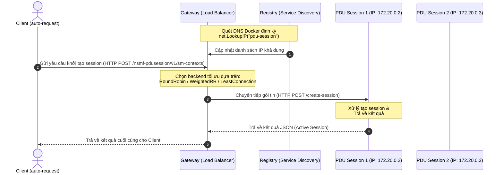

# HƯỚNG DẪN DỰ ÁN & TÀI LIỆU THIẾT KẾ KIẾN TRÚC
## GATEWAY ROUTING & PDU SESSION SIMULATOR

Hệ thống mô phỏng quy trình định tuyến gói tin (Gateway Routing) và xử lý phiên kết nối (PDU Session) trong kiến trúc 5G Core đơn giản hóa. Hệ thống được thiết kế tối ưu hóa hiệu năng, chịu tải cao, tích hợp cân bằng tải (Load Balancing) và tự động phát hiện dịch vụ (Service Discovery).

---

## 1. SƠ ĐỒ KIẾN TRÚC & LUỒNG DỮ LIỆU (FLOW)

Dưới đây là mô hình tương tác giữa Client bắn tải (`auto-request`), Gateway định tuyến, và cụm các instance xử lý dịch vụ (`pdu-session`):



---

## 2. KIẾN TRÚC CÁC THÀNH PHẦN CHI TIẾT

### 2.1 Cổng Kết Nối Định Tuyến (Gateway)
Gateway đóng vai trò là điểm tiếp nhận duy nhất (Single Point of Entry) cho mọi yêu cầu khởi tạo session từ phía Client.
* **Cơ chế Service Discovery (Tự phát hiện dịch vụ)**:
  * Gateway không sử dụng địa chỉ IP cứng. Thay vào đó, một Goroutine nền chạy hàm `registry.ServiceDiscovery()`.
  * Nó gọi hàm `net.LookupIP("pdu-session")` để truy vấn DNS nội bộ của Docker. Docker Engine sẽ tự động trả về danh sách IP của tất cả các container thuộc dịch vụ `pdu-session` đang chạy.
  * Danh sách này liên tục được đồng bộ hóa với Registry nội bộ để thêm mới các instance vừa scale-up hoặc loại bỏ các instance bị lỗi (scale-down/crashed).
* **Cơ chế Health Check (Kiểm tra sức khỏe)**:
  * Một Goroutine định kỳ gửi request `/health` tới từng instance. Nếu instance không phản hồi trong khoảng thời gian cấu hình, cờ `Healthy` sẽ được chuyển thành `false` và instance đó tạm thời bị loại khỏi danh sách định tuyến.
* **Thuật toán Cân bằng tải (Load Balancing)**:
  * **Round Robin (RR)**: Định tuyến luân phiên đều giữa các instance khỏe mạnh.
  * **Weighted Round Robin (WRR)**: Phân phối yêu cầu dựa theo trọng số sức mạnh cấu hình trước của từng instance (ví dụ: máy mạnh gánh nhiều tải hơn).
  * **Least Connections (Load Balancer)**: Định tuyến gói tin mới vào instance có số lượng request đang xử lý (`ActiveRequests`) thấp nhất tại thời điểm đó (được thu thập qua API `/metrics`).


### 2.2 Công Cụ Bắn Tải Tự Động (Auto-Request)
Công cụ kiểm thử hiệu năng (Benchmark Tool) viết bằng Go, tối ưu hóa concurrency qua Goroutines và Channels.
* **Cơ chế Concurrency Control**: Sử dụng mô hình Worker Pool (giới hạn tối đa 500 luồng chạy song song) để đẩy tải cực hạn lên Gateway mà không làm sập bộ nhớ máy client.
---


## 3. QUY TRÌNH VẬN HÀNH & KIỂM THỬ

### Bước 1: Khởi động và Cấu hình Tỷ lệ (Scaling) hệ thống
* Khởi động mặc định (4 replicas):
  ```bash
  docker compose up --build
  ```
* **Scale-up / Scale-down số lượng PDU Session**:
  Mở một terminal khác và chạy lệnh sau để thay đổi số lượng bản sao chạy song song (ví dụ: nâng lên 6 hoặc hạ xuống 2):
  ```bash
  docker compose up -d --scale pdu-session=6
  ```
  *(Gateway sẽ tự động phát hiện số lượng instance thay đổi và cập nhật lại bộ cân bằng tải trong vòng 10 giây)*

### Bước 2: Thực hiện kiểm thử chạy tải (Benchmark)
Khởi chạy công cụ bắn tải `auto-request` (bằng Docker Compose hoặc chạy trực tiếp bằng Go):

* **Cách 1: Chạy qua Docker Compose (Khuyên dùng)**
  ```bash
  docker compose run --rm auto-request
  ```

* **Cách 2: Chạy trực tiếp trên máy vật lý**
  ```bash
  cd auto-request
  go run .
  ```

#### Các bước thiết lập tham số kiểm thử:
Chương trình tương tác qua dòng lệnh và sẽ lần lượt yêu cầu nhập các tham số:
1. **Nhập số lượng request**: Tổng số gói tin cần gửi đi (ví dụ: `5000`).
2. **Nhập số lượng connection**: Số lượng kết nối HTTP/2 multiplexing song song tới Gateway (mặc định `1`).
3. **Nhập số lượng Worker song song**: Số lượng luồng Worker xử lý đồng thời (mặc định `100`).

#### Thao tác điều khiển:
* Nhập `exit` hoặc `quit` tại màn hình nhắc lệnh để thoát chương trình.
* Nhấn phím **ESC** bất cứ lúc nào để dừng khẩn cấp vòng lặp hoặc tiến trình bắn tải một cách an toàn.

---

## 4. KẾT QUẢ KIỂM THỬ TẢI THỰC TẾ (BENCHMARK RESULT)

Kết quả kiểm thử tối ưu đạt được trên cụm hệ thống (4 HTTP/2 Connections, 60 Workers song song, 4 Instances PDU Session):

```text
=== CẤU HÌNH KIỂM THỬ ===
- Số lượng Request: 8,000
- Số lượng Connections: 4
- Số lượng Worker song song: 60

=== KẾT QUẢ TEST TẢI ĐỒNG THỜI ===
Thời gian chạy: 540.58ms (0.54s)
Tổng số Request gửi đi: 8,000
Thành công: 8,000 (100%)
Thất bại: 0 (0%)
TPS gửi đi: 14,798.85 req/s
TPS thành công: 14,798.85 req/s

=== PHÂN PHỐI TẢI TRÊN CÁC INSTANCES ===
Instance pdu-session-1 xử lý: 2,000 requests (25.00%)
Instance pdu-session-2 xử lý: 2,000 requests (25.00%)
Instance pdu-session-3 xử lý: 2,000 requests (25.00%)
Instance pdu-session-4 xử lý: 2,000 requests (25.00%)
```

> [!NOTE]
> Kết quả có thể bị ảnh hưởng bởi tài nguyên CPU, RAM nên có thể không giống nhau ở các lần chạy, sai lệch có thể từ 10-20%.
> 

