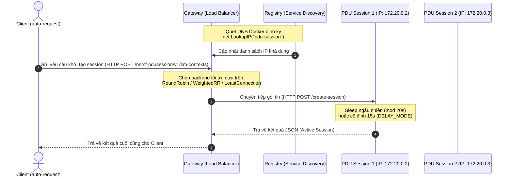

# TÀI LIỆU THIẾT KẾ & KIẾN TRÚC HỆ THỐNG
## GATEWAY ROUTING & PDU SESSION SIMULATOR

Hệ thống mô phỏng quy trình định tuyến gói tin (Gateway Routing) và xử lý phiên kết nối (PDU Session) trong kiến trúc 5G Core đơn giản hóa. Hệ thống được thiết kế tối ưu hóa hiệu năng, chịu tải cao, tích hợp cân bằng tải (Load Balancing) và tự động phát hiện dịch vụ (Service Discovery).

---

## 1. SƠ ĐỒ KIẾN TRÚC & LUỒNG DỮ LIỆU (FLOW)

Dưới đây là mô hình tương tác giữa Client bắn tải (`auto-request`), Gateway định tuyến, và cụm các instance xử lý dịch vụ (`pdu-session`):



---

## 2. KIẾN TRÚC CÁC THÀNH PHẦN CHI TIẾT

### 2.1 Cổng Kết Nối Định Tuyến (Gateway)
Gateway đóng vai trò là điểm tiếp nhận duy nhất (Single Point of Entry) cho mọi yêu cầu khởi tạo session từ phía Client.
* **Cơ chế Service Discovery (Tự phát hiện dịch vụ)**:
  * Gateway không sử dụng địa chỉ IP cứng. Thay vào đó, một Goroutine nền chạy hàm `registry.ServiceDiscovery()`.
  * Nó gọi hàm `net.LookupIP("pdu-session")` để truy vấn DNS nội bộ của Docker. Docker Engine sẽ tự động trả về danh sách IP của tất cả các container thuộc dịch vụ `pdu-session` đang chạy.
  * Danh sách này liên tục được đồng bộ hóa với Registry nội bộ để thêm mới các instance vừa scale-up hoặc loại bỏ các instance bị lỗi (scale-down/crashed).
* **Cơ chế Health Check (Kiểm tra sức khỏe)**:
  * Một Goroutine định kỳ gửi request `/health` tới từng instance. Nếu instance không phản hồi trong khoảng thời gian cấu hình, cờ `Healthy` sẽ được chuyển thành `false` và instance đó tạm thời bị loại khỏi danh sách định tuyến.
* **Thuật toán Cân bằng tải (Load Balancing)**:
  * **Round Robin (RR)**: Định tuyến luân phiên đều giữa các instance khỏe mạnh.
  * **Weighted Round Robin (WRR)**: Phân phối yêu cầu dựa theo trọng số sức mạnh cấu hình trước của từng instance (ví dụ: máy mạnh gánh nhiều tải hơn).
  * **Least Connections (Load Balancer)**: Định tuyến gói tin mới vào instance có số lượng request đang xử lý (`ActiveRequests`) thấp nhất tại thời điểm đó (được thu thập qua API `/metrics`).

### 2.2 Đơn Vị Xử Lý Phiên Kết Nối (PDU Session)
Mô phỏng chức năng Session Management Function (SMF) trong mạng 5G.
* **Scale-out**: Được cấu hình chạy song song **4 bản sao (Replicas)** độc lập trong file Docker Compose.
* **Kiểm soát thời gian xử lý (Delay Simulation)**:
  * **Chế độ trễ cố định**: Luôn mất đúng 15 giây để xử lý xong một gói tin.
  * **Chế độ trễ ngẫu nhiên**: Sử dụng hàm sinh số ngẫu nhiên modulo 20 (`rand.Intn(20)`) để tạo độ trễ biến thiên từ `0` đến `19` giây trên mỗi gói tin, giúp giả lập môi trường mạng thực tế có độ trễ bất định.

### 2.3 Công Cụ Bắn Tải Tự Động (Auto-Request)
Công cụ kiểm thử hiệu năng (Benchmark Tool) viết bằng Go, tối ưu hóa concurrency qua Goroutines và Channels.
* **Cơ chế Concurrency Control**: Sử dụng mô hình Worker Pool (giới hạn tối đa 500 luồng chạy song song) để đẩy tải cực hạn lên Gateway mà không làm sập bộ nhớ máy client.
* **Hủy khẩn cấp bằng phím ESC**: Tích hợp DLL `msvcrt.dll` trên Windows để bắt sự kiện phím bấm thời gian thực không chặn. Khi người dùng nhấn phím ESC, chương trình lập tức nhận diện và dừng vòng lặp bắn tải một cách an toàn.

---

## 3. HƯỚNG DẪN CẤU HÌNH HỆ THỐNG

### 3.1 Cấu hình tài nguyên & Biến môi trường (Docker Compose)
Tệp cấu hình [docker-compose.yml](file:///d:/20252/Viettel-5G/MiniProject-Dong/Project/Gateway%20Routing/docker-compose.yml) cho phép điều chỉnh các tham số vận hành chính:

```yaml
services:
  gateway:
    build:
      context: ./gateway
    ports:
      - "8080:8080" # Map cổng 8080 ra ngoài máy vật lý
    deploy:
      resources:
        limits:
          cpus: "0.65" # Giới hạn Gateway chỉ được dùng tối đa 65% của 1 CPU Core

  pdu-session:
    build:
      context: ./pdu-session
    environment:
      - INSTANCE_ID=
      - PORT=9001
      - DELAY_MODE=random # Chế độ trễ: điền "fixed" (cố định 15s) hoặc "random" (ngẫu nhiên mod 20s)
    deploy:
      replicas: 4 # Số lượng instance chạy song song (mặc định 4)
      resources:
        limits:
          cpus: "0.65" # Giới hạn mỗi instance PDU chỉ được dùng tối đa 65% của 1 CPU Core
```

### 3.2 Cấu hình đồng bộ Timeout trong Code
Khi tăng thời gian xử lý gói tin (ví dụ: tối đa 19 giây ở chế độ random), các thông số Timeout trong code Go bắt buộc phải lớn hơn để tránh lỗi `Gateway Timeout`:

* **Trong Gateway** ([gateway/main.go](file:///d:/20252/Viettel-5G/MiniProject-Dong/Project/Gateway%20Routing/gateway/main.go)):
  ```go
  var pduClient = &http.Client{
      Timeout: 30 * time.Second, // Đảm bảo lớn hơn thời gian xử lý tối đa của PDU Session (19s)
  ...
  ```
* **Trong Client** ([auto-request/main.go](file:///d:/20252/Viettel-5G/MiniProject-Dong/Project/Gateway%20Routing/auto-request/main.go)):
  ```go
  var config = Config{
      ClientTimeout:  30 * time.Second, // Timeout cho các kết nối HTTP Client gửi tới Gateway
  ...
  ```

---

## 4. QUY TRÌNH VẬN HÀNH & KIỂM THỬ

### Bước 1: Khởi động hệ thống
```bash
docker compose up --build
```

### Bước 2: Theo dõi hiệu năng thời gian thực (Giới hạn CPU)
Mở một terminal và gõ lệnh sau để xem mức độ sử dụng CPU có bị giới hạn dưới 65% dưới tải nặng hay không:
```bash
docker stats
```

### Bước 3: Thực hiện chạy tải
Chạy tool `auto-request`:
```bash
go run .
```
1. Chọn chế độ tự động bắn theo chu kỳ (mỗi 5-7 giây bắn 500 requests) để kiểm tra độ ổn định lâu dài của Gateway.
2. Chọn chế độ bắn thủ công để kiểm tra sức chịu tải tức thời của hệ thống với số lượng request lớn tùy chọn.
3. Nhấn **ESC** bất cứ lúc nào để dừng chương trình kiểm thử.
